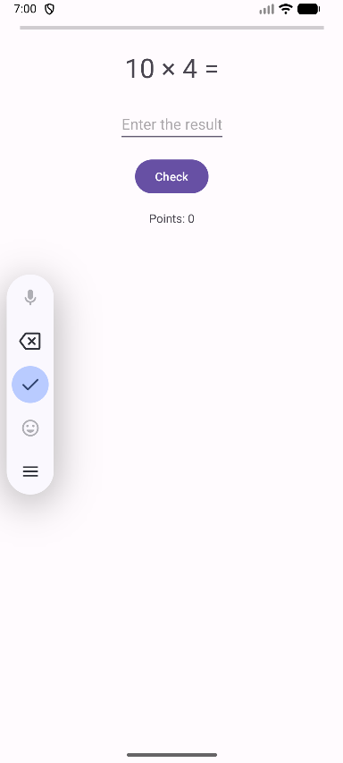

# MathMentor

MathMentor to aplikacja mobilna pomagająca dzieciom uczyć się tabliczki mnożenia w przyjazny sposób.

## Funkcje

- tryb ćwiczeń
- tryb testu (20 przykładów)
- obsługa dwóch języków
- prosty i czytelny interfejs dla dzieci

## Technologie

- Java
- Android Studio
- Gradle

## Plan rozwoju

### Version 1.1
- poprawa testu (podział na strony)
- możliwość zmiany języka w menu

### Version 1.2
- tabliczka dzielenia

### Version 2.0
- nauka ułamków

## Screenshots

Main menu  

Practice mode  

